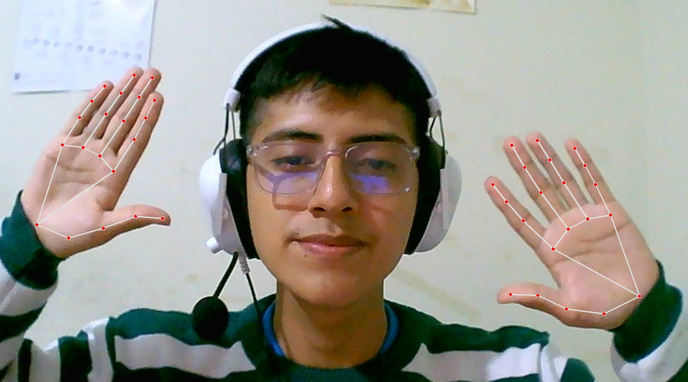

# Supervisor con IA para detectar intentos de plagio en exámenes remotos/virtuales


# Se utiliza FastAPI

Este proyecto utiliza **FastAPI**, un moderno y rápido framework web para construir APIs con Python. Está basado en estándares como **Python 3.7+** y **Starlette**. Es ideal para crear aplicaciones web y APIs RESTful de alto rendimiento.

## 🚀 Requisitos

- Python 3.7 o superior
- pip (gestor de paquetes de Python)

## 📦 Instalación

Sigue estos pasos para instalar las dependencias del proyecto.

1. Clona el repositorio:

   ```bash
   git clone https://github.com/tu_usuario/tu_repositorio.git](https://github.com/Daniee19/SupervisorExamenRemotoIA.git

## 🛠️ Uso

Para iniciar el servidor de desarrollo de FastAPI, utiliza el siguiente comando:

```bash
uvicorn app.main:app --reload
```
Esto iniciará el servidor en http://localhost:8000. La opción --reload permite que el servidor se recargue automáticamente cuando se realicen cambios en el código.

## 🧑‍💻 ¿Cómo trabajar con el proyecto?

Routers: En la carpeta routers/ puedes definir las rutas de tu API. Cada archivo en esta carpeta representa un conjunto de rutas relacionadas.

Models: En la carpeta models/ defines los modelos de datos que interactúan con la base de datos.

Schemas: En la carpeta schemas/ defines los esquemas que se usan para validar y serializar los datos en las respuestas y peticiones de la API.

Services: La carpeta services/ contiene la lógica de negocio que se utiliza dentro de la aplicación, como la manipulación de datos antes de ser devueltos o procesados.

Static & Templates: Si tu aplicación tiene una interfaz web, coloca los archivos estáticos (imágenes, archivos CSS, JS) en la carpeta static/, y las plantillas HTML en la carpeta templates/.

## Se implementó la librería de mediapipe para detectar manos


## Se implementó la librería de mediapipe para detectar el rostro

